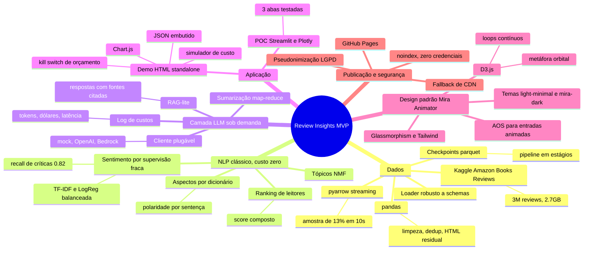

# 📚 Review Insights — MVP

**Demo ao vivo:** [flaviagaia.github.io/review-insights-demo](https://flaviagaia.github.io/review-insights-demo/)

Análise inteligente de avaliações de livros com NLP e IA Generativa: de dias de leitura manual
para segundos, com custo, segurança e qualidade monitorados desde o primeiro dia.

**Dados:** [Amazon Books Reviews (Kaggle)](https://www.kaggle.com/datasets/mohamedbakhet/amazon-books-reviews) —
3 milhões de reviews públicas, processadas por amostragem aleatória (~378 mil) e exibidas com
identificadores de leitores **pseudonimizados** (hash SHA-256).

## 🧠 Mapa mental — o que foi usado para construir este MVP

## 🗺 Como navegar na demo

1. **📊 Análise** — escolha autor, gênero ou livro: KPIs animados, distribuição de notas,
   sentimento ao longo do tempo, aspectos elogiados/criticados e sumário executivo gerado
   sobre as reviews selecionadas.
2. **💬 Pergunte às reviews** — perguntas em linguagem natural com resposta ancorada em
   trechos citados `[R0]`, `[R1]`... (contrato anti-alucinação).
3. **📡 Monitoramento & FinOps** — custo acumulado por chamada, simulador de custo mensal
   por modelo (Haiku, Sonnet, GPT-4o-mini, Llama) e controle de orçamento com kill switch.

## 🔒 Segurança dos dados

- Reviews são públicas (dataset Kaggle acima); ainda assim, nenhum nome de usuário é exibido:
  IDs viram pseudônimos por hash ("Leitor EA91BB").
- Página com `noindex, nofollow`; nenhuma credencial ou chave de API no código.
- Nenhuma chamada externa além dos CDNs de bibliotecas (Tailwind, D3, Chart.js, AOS).

## ⚙️ Stack em uma linha

`pyarrow · pandas · scikit-learn (TF-IDF, LogReg, NMF) · estratégia map-reduce para LLM ·
Streamlit/Plotly (POC) · HTML + Chart.js + D3 + AOS + Tailwind (demo) · GitHub Pages`

---
*Desenvolvido por Flávia Guimarães Gaia Paula.*
