# 📚 Review Insights — MVP


**Demo ao vivo:** [flaviagaia.github.io/review-insights-demo](https://flaviagaia.github.io/review-insights-demo/)

Análise inteligente de avaliações de livros com NLP e IA Generativa: de dias de leitura manual
para segundos, com custo, segurança e qualidade monitorados desde o primeiro dia.

**Dados:** [Amazon Books Reviews (Kaggle)](https://www.kaggle.com/datasets/mohamedbakhet/amazon-books-reviews) —
3 milhões de reviews públicas, processadas por amostragem aleatória (~378 mil) e exibidas com
identificadores de leitores **pseudonimizados** (hash SHA-256).

## 🗺 Como a solução funciona (e por quê)

```mermaid
flowchart LR
    K[("📚 Kaggle<br/>3M reviews · 2.7GB")]
    subgraph P["1 · Preparação"]
        direction TB
        P1["pyarrow — amostra em ~10s"]
        P2["pandas — limpeza e joins"]
        P3["parquet — checkpoints"]
    end
    subgraph N["2 · NLP clássico — custo ~zero"]
        direction TB
        N1["Sentimento — TF-IDF + LogReg"]
        N2["Tópicos e aspectos"]
        N3["Ranking de leitores"]
    end
    subgraph L["3 · LLM sob demanda — LangChain"]
        direction TB
        L1["Sumário executivo — map-reduce"]
        L2["Q&A — RAG com fontes citadas"]
    end
    subgraph E["4 · Entrega"]
        direction TB
        E1["App Streamlit — para a banca"]
        E2["Demo web ao vivo — para todos"]
    end
    K --> P --> N --> L --> E
    T["🔒📡 Transversal: pseudonimização · anti-injection · custo por chamada · testes/CI"]
    P -.-> T
    E -.-> T
    classDef stage fill:#FFF6EC,stroke:#E8722A,color:#4A3120
    classDef hero fill:#FDE8D7,stroke:#C05621,color:#7A3C10
    classDef item fill:#FFFFFF,stroke:#E8B48A,color:#4A3120
    class P,N,L,E stage
    class K,T hero
    class P1,P2,P3,N1,N2,N3,L1,L2,E1,E2 item
```



**A leitura em uma frase:** 100% do volume passa pelo NLP clássico (barato e auditável);
o LLM entra só onde gera valor único; segurança e observabilidade acompanham tudo.

| Etapa | Tecnologia | Por quê |
|---|---|---|
| 1 · Preparação | pyarrow + parquet | varre 2,7GB em ~10s e cria checkpoints — pipeline retomável, cabe em pouca RAM |
| 1 · Preparação | pandas | limpeza expressiva: dedup, HTML residual, joins com metadados |
| 2 · NLP clássico | TF-IDF + LogReg | milhões de textos a custo ~zero; as estrelas rotulam o treino (zero anotação) |
| 2 · NLP clássico | NMF + dicionários | tópicos e aspectos que o negócio entende e audita |
| 3 · LLM | LangChain (LCEL) | mesmo chain roda offline (mock), OpenAI ou Bedrock; callback loga custo/latência |
| 3 · LLM | map-reduce + RAG | escala para milhares de reviews; respostas sempre citam as fontes (anti-alucinação) |
| 4 · Entrega | Streamlit + GitHub Pages | a banca clona e roda; qualquer pessoa testa pelo link, sem instalar nada |
| Transversal | hash SHA-256 · sanitização · CI | LGPD na prática, prompts blindados contra injection, qualidade a cada push |

## 🚀 Duas formas de testar

1. **Sem instalar nada:** demo interativa ao vivo em
   [flaviagaia.github.io/review-insights-demo](https://flaviagaia.github.io/review-insights-demo/)
   (dados reais pré-processados, leitores pseudonimizados).
2. **POC completa (Streamlit):** clone este repositório e siga
   [Como executar](#-como-executar) — roda offline com `LLM_PROVIDER=mock`,
   sem nenhuma API key.

## 🎯 O problema

A editora precisa de respostas rápidas para três perguntas recorrentes:

1. **Como está a performance de um autor ou gênero?** (além da média de estrelas)
2. **O que os leitores elogiam e criticam, concretamente?**
3. **Quais leitores têm opiniões relevantes para uma entrevista?**

Hoje: processo manual, ~R$ 25.000/mês de custo salarial da equipe, capacidade de ~35 análises/mês.

## 💡 Hipóteses que guiaram a solução

| # | Hipótese | Como foi validada |
|---|----------|-------------------|
| H1 | A nota média esconde insatisfação: reviews 4-5★ dominam (~80%) e inflacionam a percepção | EDA: distribuição de notas + sentimento do texto |
| H2 | Poucos leitores concentram a maior parte dos votos de utilidade → shortlist objetiva para entrevistas | Curva de concentração de `helpful votes` |
| H3 | O sentimento do **texto** discrimina melhor a performance que as estrelas (especialmente nas 3★, que são ambíguas) | Modelo de sentimento por supervisão fraca separa 3★ em pos/neg |
| H4 | Os aspectos criticados variam por gênero (ficção: ritmo/personagens; técnico: clareza/atualização) | Matriz aspecto × gênero |
| H5 | O volume segue cauda longa: poucos títulos concentram 80% das reviews → esforço manual mal alocado | Curva de Pareto |

## 🏗 Arquitetura da POC

```
Books_rating.csv ─┐
                  ├─> data_loader ─> nlp_pipeline ──> EDA / figuras
books_data.csv  ──┘        │        (sentimento, tópicos,│aspectos, ranking)
                           │                             │
                           └──> summarizer (map-reduce) ─┴─> Streamlit App
                                     │
                              llm_client (mock | OpenAI | Bedrock)
                                     │
                              logs/llm_usage.jsonl (tokens, custo, latência)
```

**Decisões de design:**

- **NLP clássico para volume, LLM para valor.** Sentimento, aspectos e tópicos rodam com
  TF-IDF + regressão logística / NMF: milhões de reviews a custo ~zero. O LLM entra só na
  sumarização/Q&A — reduz o custo por análise em ~100x vs. "mandar tudo pro LLM".
- **Supervisão fraca**: as estrelas rotulam o treino do modelo de sentimento — sem custo
  de anotação e aplicável ao dataset real inteiro.
- **Map-reduce na sumarização**: blocos de reviews são resumidos e depois consolidados —
  escala para autores com milhares de reviews sem estourar contexto.
- **Camada LLM em LangChain (LCEL)**: chains `prompt | llm | parser` com provedor plugável
  (`LLM_PROVIDER=mock|openai|bedrock` — o mock implementa a interface `LLM` e roda offline).
  Observabilidade via `BaseCallbackHandler` (tokens, custo, latência por chamada); em produção,
  traces com **LangSmith** ligando `LANGCHAIN_TRACING_V2=true`, sem tocar no código.

## 🚀 Como executar

```bash
git clone <repo> && cd review-insights
python -m venv .venv && source .venv/bin/activate
pip install -r requirements.txt

# 1. Dados: reais (Kaggle) OU amostra sintética
#    Reais: baixe https://www.kaggle.com/datasets/mohamedbakhet/amazon-books-reviews
#           e coloque Books_rating.csv + books_data.csv em data/raw/
#    Amostra (sem download, mesmo schema):
python -m src.generate_sample

# 2. EDA + validação de hipóteses (gera reports/figures/)
python scripts/run_analysis.py

# 3. App (POC)
cp .env.example .env          # LLM_PROVIDER=mock roda sem API key
streamlit run app/streamlit_app.py
```

> Com o CSV real (2.7GB): `python scripts/run_analysis.py --data-dir data/raw --sample-frac 0.13`
> faz amostragem aleatória por chunks (evita o viés de posição do `nrows`).
> Em máquinas com pouca RAM, use o pipeline em estágios com checkpoints parquet:
> `stage_sample.py` (amostra via pyarrow) → `stage_prepare.py` (limpeza/merge) →
> `stage_sentiment.py fit|score|merge` → `stage_figures.py core|aspects|final`.
> O loader é robusto a variantes de schema do download (ex.: colunas `score/text`
> sem prefixo `review/` e ausência de `helpfulness` — o ranking se adapta).

**Resultados na base real** (amostra aleatória de 378 mil de 3 milhões de reviews):
80% das reviews são 4-5★ (H1); 31% dos títulos concentram 80% do volume (H5);
nas 32 mil reviews 3★ o modelo separa 38% negativas / 42% positivas (H3);
10% dos leitores escrevem 45% das reviews (H2); sentimento com recall de críticas
0,82 e macro-F1 0,81 no holdout (classe negativa balanceada por `class_weight`).

## ☁️ Roadmap incremental na AWS

| Fase | Escopo | Serviços | Custo estimado/mês |
|------|--------|----------|--------------------|
| **0 — POC** (esta entrega) | Pipeline local + Streamlit | — | ~R$ 0 |
| **1 — Batch produtivo** (2-4 sem) | Ingestão + pipeline NLP agendado + dashboard | S3, Glue/Athena, Lambda/ECS Fargate, Step Functions, Bedrock (batch), QuickSight | ~US$ 150–400 |
| **2 — Base de conhecimento (RAG)** (4-8 sem) | Busca semântica + chat "pergunte às reviews" | Bedrock Knowledge Bases (Titan Embeddings + OpenSearch Serverless), API Gateway, Lambda | ~US$ 400–900 |
| **3 — Escala e governança** (contínuo) | Avaliação contínua, guardrails, FinOps | Bedrock Guardrails, CloudWatch, Cost Explorer + tags, SageMaker (fine-tuning opcional) | proporcional ao uso |

### Segurança e governança de dados (LGPD)

- **PII**: `User_id`/`profileName` pseudonimizados no ingest (hash + salt); em produção,
  detecção automática de PII no texto com **Amazon Comprehend** antes de qualquer chamada LLM.
- **Criptografia**: S3/OpenSearch com **KMS**; tráfego via **VPC endpoints** (dados nunca
  saem da rede privada — Bedrock não usa dados para treino).
- **Acesso**: IAM least-privilege por perfil; trilha de auditoria com CloudTrail.
- Práticas herdadas de projetos com dados sensíveis de saúde — o mesmo rigor aplicado aqui.

### Monitoramento e custos (FinOps)

- **Já na POC**: aba dedicada **Monitoramento & FinOps** no app com custo acumulado,
  latência por chamada, simulador de custo mensal por modelo (Haiku, Sonnet, GPT-4o-mini,
  Llama) e controle de orçamento com kill switch — alimentada pelo log estruturado
  `logs/llm_usage.jsonl` (tokens in/out, custo USD, latência por chamada).
- **Por que um painel nativo e não Grafana/Prometheus no MVP**: Prometheus/Grafana exigem
  infraestrutura própria (servidor, scraping) sem ganho numa POC single-node; a decisão
  madura é instrumentar primeiro (log estruturado) e plugar a telemetria na stack de
  produção depois. **MLflow** entra em outra frente: tracking de experimentos e registry
  do modelo de sentimento (natural em ambientes Databricks).
- **Produção**: CloudWatch dashboards (latência, taxa de erro, tokens/dia) ou Grafana,
  alarmes de orçamento (AWS Budgets + SNS), tags de custo por feature, amostragem de
  respostas para avaliação contínua (LLM-as-judge + revisão humana).

## 📏 Métricas de qualidade

| Camada | Métrica | Alvo |
|--------|---------|------|
| Sentimento | F1 no holdout (rótulos = estrelas) | ≥ 0.85 |
| Sumarização | Fidelidade (LLM-as-judge + amostra humana), cobertura de aspectos | ≥ 90% sem alucinação |
| RAG (fase 2) | RAGAS: faithfulness, answer relevance, context recall | ≥ 0.8 |
| Ranking de leitores | Precision@10 validada com analistas | ≥ 70% aprovação |
| Negócio | Tempo por análise; análises/mês; custo por análise | 3 dias → < 1 h |

## 💰 Impacto estimado

- Hoje: 5 analistas × R$ 5.000 = **R$ 25.000/mês**; ~3 dias por análise (~R$ 714/análise).
- Com a ferramenta: análise em minutos; custo LLM estimado **< R$ 5/análise**;
  ~**80% do tempo da equipe liberado** (~R$ 20.000/mês ≈ **R$ 240.000/ano** realocáveis),
  com capacidade de análise ~10x maior e analistas focados em decisão, não em leitura.

## 📂 Estrutura

```
├── app/streamlit_app.py       # POC em 4 abas: Análise | Pergunte às reviews | Monitoramento & FinOps | Produção AWS
├── scripts/run_analysis.py   # EDA + figuras da apresentação
├── src/
│   ├── data_loader.py        # carga/limpeza (real ou amostra)
│   ├── generate_sample.py    # amostra sintética (schema Kaggle)
│   ├── nlp_pipeline.py       # sentimento, tópicos, aspectos, ranking
│   ├── llm_client.py         # mock | OpenAI | Bedrock + logging de custo
│   ├── qa.py                 # Q&A (RAG-lite) com citação de fontes
│   └── summarizer.py         # sumarização map-reduce
├── notebooks/                # storytelling da análise
└── reports/                  # figuras e sumários gerados
```

## 🧪 Apêndice técnico

### Backlog de hipóteses avançadas (próximos experimentos)

| # | Hipótese | Teste | Ação de negócio |
|---|----------|-------|-----------------|
| H6 | O sentimento do texto cai antes da média de estrelas | Correlação cruzada defasada por título | Alerta precoce para a editora |
| H7 | Queda de sentimento em leitores recorrentes de um autor indica perda de base | Análise de coorte por reviewer | Evidência para renovação de contrato |
| H8 | Reviews negativas longas e muito votadas puxam as notas seguintes | Regressão antes/depois de reviews âncora | Resposta rápida ou reedição |
| H9 | Críticas operacionais (formato Kindle, impressão, tradução) são corrigíveis e distintas de crítica de conteúdo | Separar famílias de aspectos por título | Fila de correção editorial com ROI direto |
| H10 | Reviewers exigentes e úteis predizem o consenso de longo prazo melhor que a média inicial | Poder preditivo das primeiras reviews desses usuários | Termômetro de lançamento |

### Análise de custos (por que a arquitetura híbrida)

- **Ingênuo (tudo no LLM):** 3M reviews × ~250 tokens ≈ 750M tokens ⇒ ~US$ 600–700 por passada (Haiku); cada reprocessamento repete o custo.
- **Híbrido (esta solução):** NLP clássico cobre 100% da base por ~US$ 5–20/passada (Fargate spot); LLM só na sumarização (~US$ 0,02–0,05/análise) ⇒ ~US$ 10–25/mês para 500 análises.
- **Custo escondido do RAG:** embeddings da base inteira ≈ US$ 15 (one-off); o caro é o vector store (OpenSearch Serverless: piso ~US$ 350/mês). Começar com pgvector no Aurora (~US$ 50–100/mês).
- **TCO/payback:** cloud US$ 200–500/mês vs R$ 20 mil/mês liberados; build das fases 1–2 (~2 meses) se paga em ~3 meses. Alavancas: Bedrock batch API (-50%), prompt caching, cache de sumários por hash, Haiku no map / Sonnet no reduce.

### Princípios de ciência de dados aplicados

- **Incerteza é parte da resposta:** rankings com suavização bayesiana (prior do gênero) e exibição de `n` — autor com 12 reviews não compete com um de 1.200.
- **Validação sem circularidade:** além do holdout por estrelas, conjunto-ouro rotulado manualmente (~200 reviews 3★) para medir o sentimento onde ele mais importa.
- **Métrica de produto > métrica de modelo:** o sucesso é decisão editorial mais rápida e melhor, medida em 2–3 decisões-alvo definidas com o negócio.
- **Active learning:** discordâncias entre modelo e analistas viram fila prioritária de rotulagem.
- **Dados como produto:** reviews enriquecidas em camadas bronze/silver/gold, reutilizáveis para recomendação, marketing e pricing.

### Caminho de produção (MLOps)

- **Versionamento em 3 eixos:** dados (partições imutáveis), modelo (SageMaker Registry) e prompts como código, com suite de regressão no CI antes de promover. IaC via Terraform, contas dev/prod separadas.
- **Monitoramento em 3 camadas:** sistema (latência, erro, custo por tag), dados (drift de vocabulário via PSI, taxa de PII, volume) e qualidade (LLM-as-judge com rubrica + revisão humana semanal; concordância modelo × analista como métrica norte).
- **Rollout:** shadow mode (2–4 semanas) → uso assistido com feedback embutido (thumbs up/down vira dataset de avaliação) → descomissionamento do processo manual.
- **Operação segura:** kill switch por orçamento diário (AWS Budgets), runbook de falhas (throttling, atraso, escalonamento) e inferência batch — reviews não são streaming, não sobre-engenheirar.

---
*Desenvolvido por Flávia Guimarães Gaia Paula como case técnico de NLP/LLMs.*
